# 👋 Hi there

I'm Marcos, a dedicated software developer and technology enthusiast. Currently, I work as a Software Developer at Thoughtworks. With over 5 year of experience in the field, I've had the opportunity to work on various exciting projects and explore different technologies.

# 🚀 Expertise

Passionate about programming logics, I specialize in back-end web development, combining modern frameworks with best practice design patterns.

Outside of the professional environment, I have three main hobbies: Working out, solving leetcode problems and playing video games (unfortunately I haven't had time for the last one)

# 💻 Tech Stack
         

# 🌐 Socials:
 
